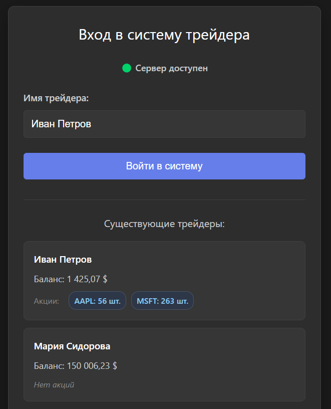
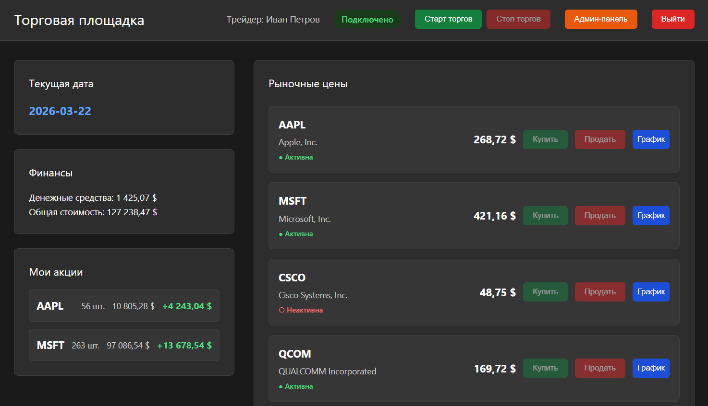
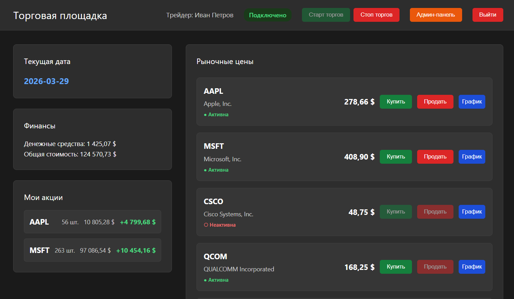
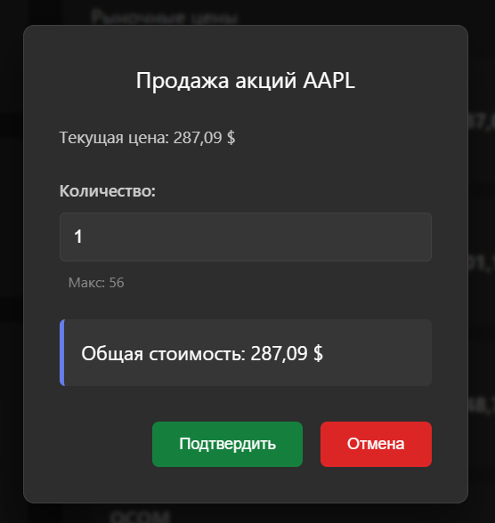
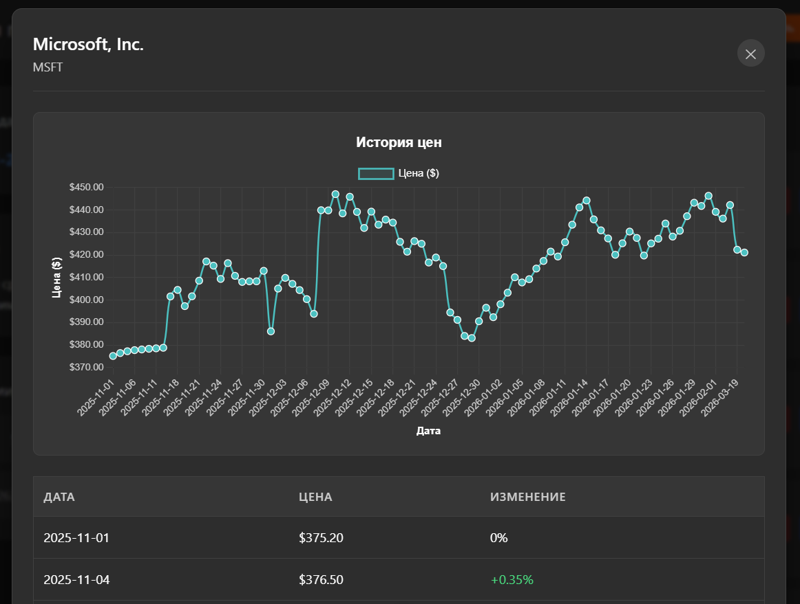
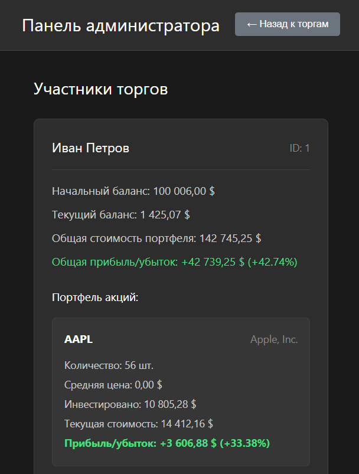
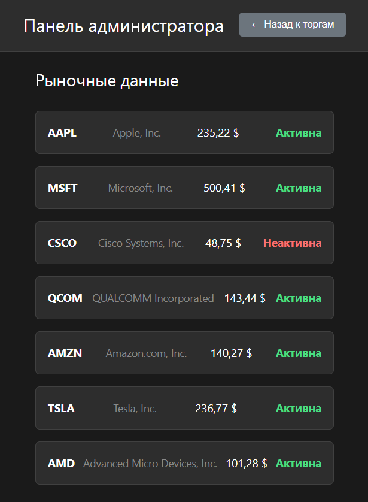
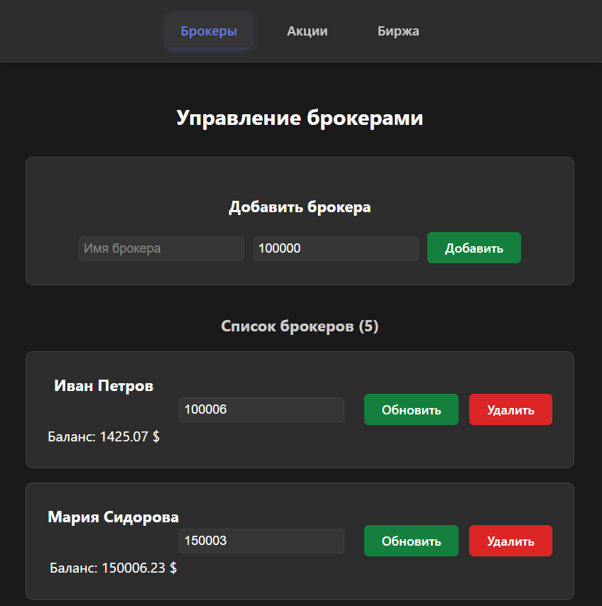
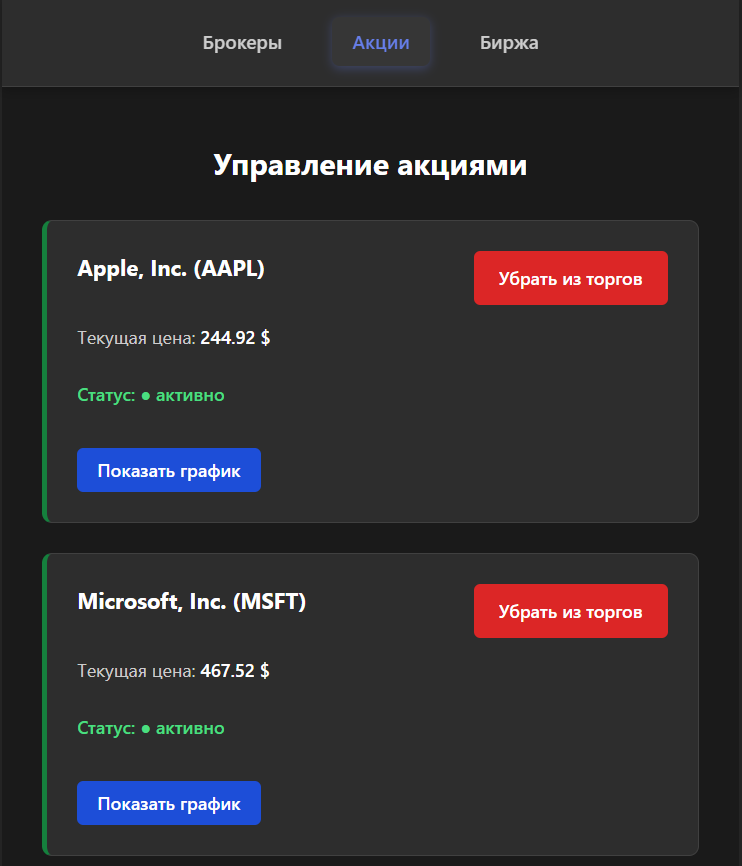
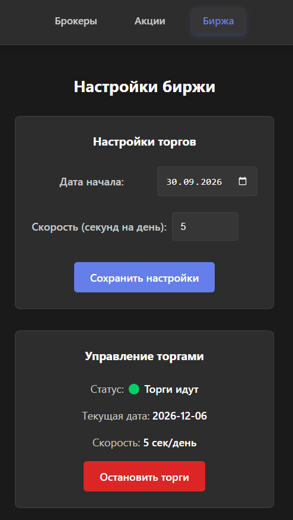

# Stock Market


Демонстративное веб-приложение для имитации торговой площадки акций.

Сервер работает на `NestJS` + `TypeScript`, фронт основного сайта написан на `Vue`, админ-панель -- на `React` (чтобы рассмотреть больше технологий).

## Установка и запуск

Клонирование репозитория и установка зависимостей:

```bash
git clone https://github.com/nhitar/stock-market.git
cd stock-market

npm i
```

Запуск сервера:

```bash
npm run dev
```

Сервер: `http://localhost:3000`.

Админ-панель: `http://localhost:5173`.

Площадка трейдинга: `http://localhost:5174`.

## Функционал

- **Авторизация** - вход в аккаунт трейдера или создание нового;
- **Использование сокетов** - запуск торгов, изменения цен, настроек рынка отображаются у всех пользователей одновременно;
- **Запуск торгов** - начало торгов для всех пользователей;
- **Покупка/продажа акций**;
- **Просмотр истории акций** - с обновляемыми таблицами цен и графиками;
- **Настройка брокеров, акций, торгов** - администрирование всего процесса происходит в админ-панеле.

## Демонстрация сайта

`Страничка авторизации`



`Страничка трейдинга`



`Процесс трейдинга`



`Покупка/продажа акций`



`История цен`



`Акции пользователей`



`Цены акций`



`Админ-панель, настройка брокеров`



`Админ-панель, настройка акций`



`Админ-панель, настройка торгов`



